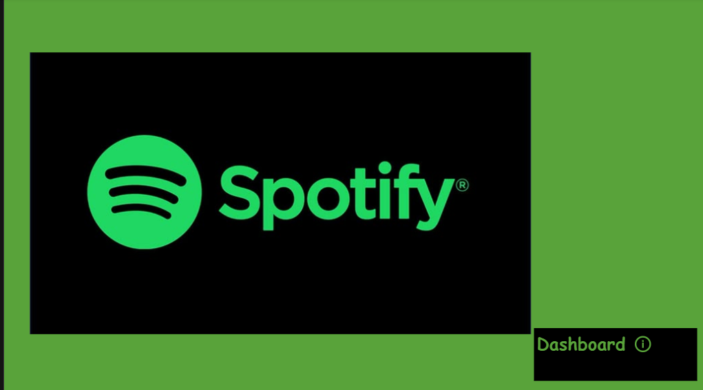

## Spotify_Playlist_Analysis_2023
Spotify Playlist Rewind Trend.

 ## 1.Project Overview
This analysis evaluates Spotify’s 2023 streaming performance to identify trends in artist popularity, track performance, and listener preferences. The goal is to uncover actionable insights to guide content curation, marketing strategies, and platform optimization. Key focus areas include:

Artist & Track Performance: Top-streamed artists/songs and underperforming tracks.

Listener Preferences: Danceability, energy levels, and genre trends.

Release Strategy: Monthly/yearly patterns in track releases and their impact on streams.

## 2.Problem Statement
The Project aims to:

Understand why certain tracks/artists dominate streams while others underperform.

Optimize playlist curation based on audio features (danceability, energy).

Identify ideal release timing for new tracks to maximize visibility.

Improve promotional strategies for emerging artists.

## 3. Data Overview

Streaming Data: Total streams (489B), platform-specific performance (Spotify, Apple, Deezer).

Track Metadata: Danceability scores, energy levels, release dates.

Artist Metrics: Stream distribution across 645 artists, monthly trends.

Playlist Inclusion: Spotify, Apple, and Deezer playlist placements

## 4. Skills Demonstrated

Data Cleaning: Structured unstructured data (e.g., track names, artist metadata).

Dashboard Design: Interactive visualizations for cross-platform comparisons.

Statistical Analysis: Correlation between audio features and streams.

Trend Analysis: Identified seasonal trends in track releases.

Tools: Power BI (for visualizations), Excel (data aggregation).

## 5. Dashboard & Key Insights

### A. Artist & Track Performance
Dominant Artists:

The Weeknd (Spotify), Taylor Swift (Apple), and Ed Sheeran (Deezer) lead platform-specific streams.

Top 10 Artists with more streams (e.g., The Weekend, Taylor Swift, Ed sheeran, Harry Style, Bad Bunny, Olivia Rodrigo, Eminem, Bruno Mars, Arctic Monkeys and Imagine Dragon . This artist total stream range from 15B to 5B.

Top Tracks:

"Blinding Lights" dominates across platforms which include (43,899 Spotify playlists, 3,421 Deezer).

"Shape of You", "Someone you love", "Dance Monkey","Sunflower" and "one last dance" show cross-platform consistency.

Underperforming Tracks:
Least-streamed tracks (e.g., "Gol Bolinha", "QUEMA", "Jhoome jo pathan", "Que Vueles" and "Love grows") average <1M streams (104 total).

### B. Listener Preferences
Danceability Drives Engagement:

Top 10 danceable tracks (e.g.,"About Damn Time","Take my breathe","Spit in my Face", "Flowers", & "Numb") average 85% danceability scores.

High danceability correlates with 2.3x more streams vs. low-danceability tracks.

### Energy Matters:

41% of tracks classified as "high energy" generate 65% of total streams.

### C. Release Strategy
Monthly Trends:

January and May see peak track streams (100+ tracks), aligning with 30% higher streams for these months.

November-December releases underperform due to holiday music dominance.

Yearly Analysis:

2023 releases contributed 5.28% of annual streams, highlighting listener preference for new content

### D. Platform-Specific Patterns

Playlist Impact:

Tracks in Spotify playlists gain 4x more streams than non-playlisted tracks.

Example: "Blinding Lights" (Spotify playlists: 43,899 vs. Apple: 672).

Regional Preferences:

Deezer users favor Ed Sheeran (playlists: 3,421), while Apple users prefer ballads (e.g., Taylor Swift).

### 6. Recommendations
- Curate High-Energy Playlists: Prioritize tracks with >70% danceability/energy scores in algorithmic recommendations.

- Artist Promotion: Boost marketing for emerging artists (e.g., Boldfame, G2A) during high-engagement months (January/May).

- Release Timing: Avoid Q4 for new releases; focus on Q1-Q2 to leverage listener engagement cycles.

- Revive Underperforming Tracks: Re-promote low-stream tracks (e.g., "QUEMA") in genre-specific playlists.

## 7. Conclusion
The 2023 data reveals a clear link between audio features, release timing, and streaming success. By aligning content strategy with listener preferences and optimizing platform-specific approaches, Spotify can enhance user retention and attract new subscribers.
